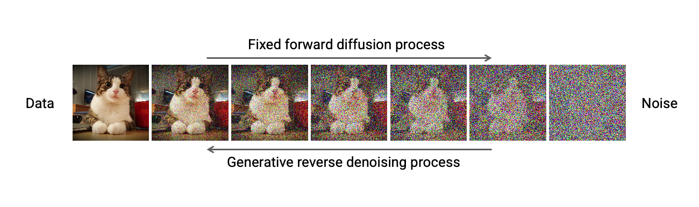
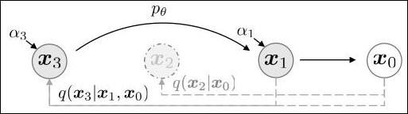
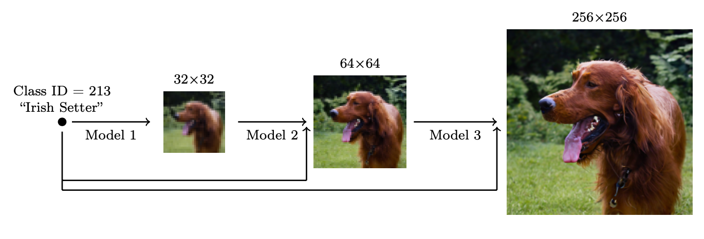
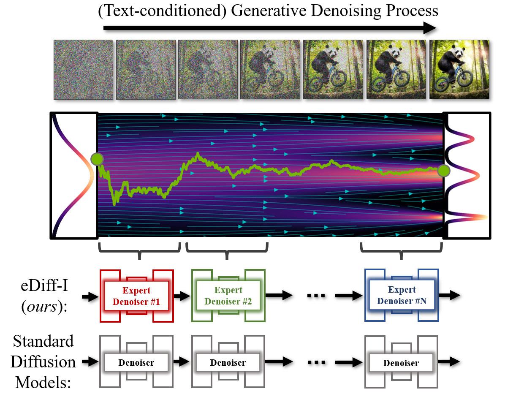
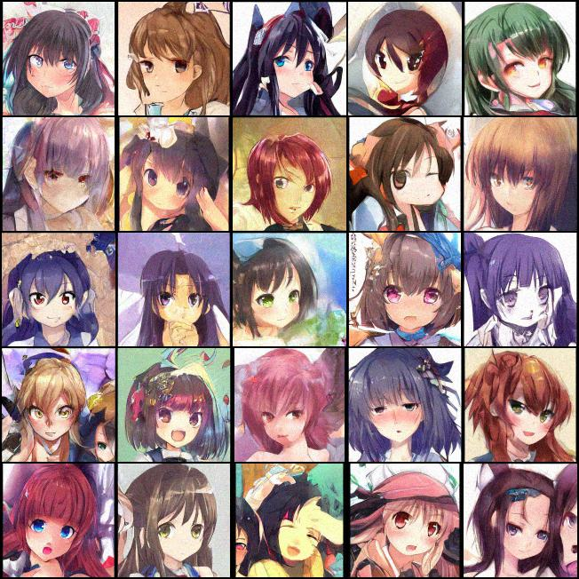
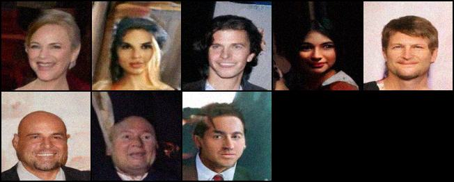
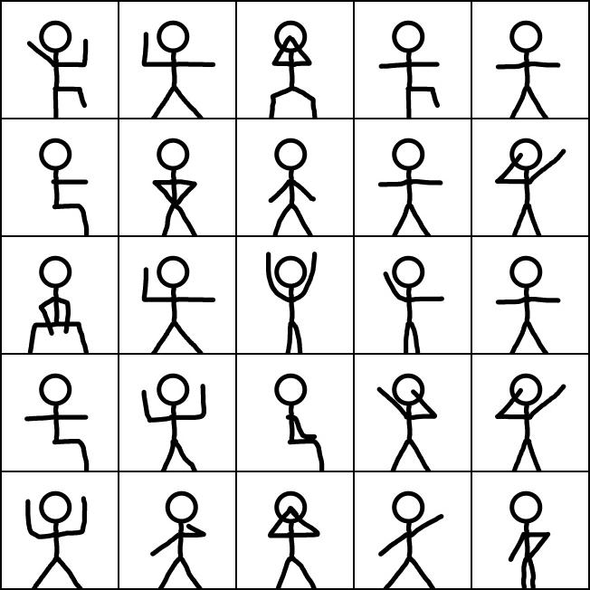
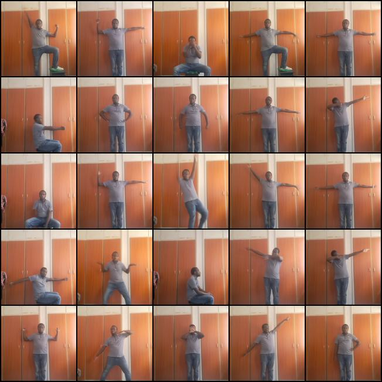
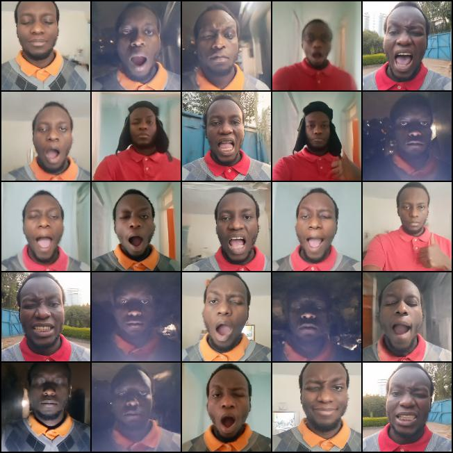

# Simple-Diffusion-Model

This repository is an attempt at a simple implementation of Diffusion Generative models which is a machine learning algorithm predominately used in the generation of images from noise. This was made in a bid to personally try and understand the technology.

The project was written in PyTorch and some liberty has been taken in the implementation of the various types of models and their parameters and so it may not match the original implementation from their respective papers.

## What is Diffusion Model (Simplified)
These are machine learning models that are trained to be able to generate data, usually images, by systematically and slowly destroying the structure in the data distribution through an iterative **forward diffusion process** i.e Gaussian Noise is slowly added to the data in incremental steps until the degraded data is approximately equivalent to the Gaussian Noise being added. In each step the model is trained to learn a **reverse diffusion process** that restores the structure in the data.

This works due to the fact that the model learns to gradually convert one distribution i.e a normal distribution: $$X \sim \mathcal{N}(0,I)$$, which is simple and easy to model using artificial neural networks into the target distribution which is usually complex and hard to model e.g picture of cats over a series of steps where each step is only dependant on the prior one excluding the initial step.

Once a model has been trained, to generate data from it one has to start by sampling from noise e.g Gaussian distribution and over a series of steps (Reverse Diffusion) the target distribution e.g images of a cat is slowly restored from the noise.


*Figure 1: Image showcasing Forward Diffusion Process of an image of a cat slowly being degraded into noise and Reverse Diffusion Process of noise being converted back to an image of a cat. From Denoising Diffusion-based Generative Modeling: Foundations and Applications, by Karsten Kreis, Ruiqi Gao, Arash Vahdat. Retrieved from https://cvpr2022-tutorial-diffusion-models.github.io*

## Implementation
The various techniques to add noise to the data distribution and which have been implemented in the code include the following:
### Linear Noise Scheduler
This is used to control the noise added to the data in each step using two parameters beta<sub>1</sub> and beta<sub>T</sub> which is set before training. The two parameters determine the rate at which noise is added to the data at each timestep where at the initial step T the value will be close to 1 and at the final step t<sub>1</sub> e.g 1, the value is closer to 0.

### Cosine Noise Scheduler
This is supposed to be an improvement of the Linear Noise Scheduler that has been tested to improve the quality of images in some papers. It only requires the final step T as a parameter.


*Figure 2: Graph comparison of Linear and Cosine Scheduler. From Improved Denoising Diffusion Probabilistic Models, by Nichol & Dhariwal, 2021. Retrieved from https://arxiv.org/abs/2102.09672*

**NOTE**:
In my implementation i’ve used Linear noise scheduler with beta<sub>1</sub> of **5e-3** and beta<sub>T</sub> of **9e-3** for DDPM and DDIM and Cosine noise scheduler for Cold Diffusion model, described below. Some experimentation with the values is needed to determine the optimal parameters for better model results.

In addition to the noise scheduler the techniques used to restore the data distribution from Gaussian Noise include the following:

### Denoising Diffusion Probabilistic Model (DDPM)
Here the data is systematically restored slowly from noise step by step by having the model attempt to predict the noise that was added to the data from the initial step, T. The predicted noise value, denoted as \epsilon and the current degraded data denoted as x<sub>t</sub> where t is the current step, is then used to predict the next step’s degraded data denoted as x<sub>t-1</sub>. This is repeated until the final step of t<sub>1</sub> is computed to get back the data.


*Figure 3: Representation of the multiple steps in a DDPM (Markov chain) of forward diffusion process and reverse diffusion process. From Denoising Diffusion Probabilistic Models, by Ho et al. 2020. Retrieved from https://arxiv.org/abs/2006.11239*

### Denoising Diffusion Implicit Model (DDIM)
This technique is similar to DDPM in that the model tries to predict the noise added to the image at each step, however this technique attempts to speed up the process by using x<sub>t</sub> and noise approximated by the model and computes the data as it would appear in the final step. Then, some steps will be skipped and the predicted data will have noise re-added to it for the next step and the process is repeated until the final step is reached. This makes it the faster option however with an increase in skipped steps, data quality may go down.



*Figure 4: Representation of the skipped steps in a DDIM (Markov chain) of forward diffusion process and reverse diffusion process. From Denoising Diffusion Implicit Models, by Song et al. 2022. Retrieved from https://arxiv.org/abs/2010.02502*

### Cold Diffusion
In this approach the model directly attempts to predict the data as it would appear in the final step from the noise at each step, some steps can be skipped similar to DDIM but the noise has to be added using a separate formula.

Combining all of the above implementations, the model(s) can be trained in various configurations in a bid to improve image quality, and image size. These include but are not limited to:
### Cascaded Diffusion Models for High Fidelity Image Generation
This comprises a pipeline of multiple diffusion models that generate images of increasing resolution, beginning with a standard diffusion model at the lowest resolution, followed by one or more super-resolution diffusion models that successively upsample the image and add higher details.

In this project the base resolution has been trained on images with dimensions of 128\*128\*3 and only one super-resolution was used for upscaling to 256\*256\*3.


*Figure 5: A cascaded pipeline of multiple diffusion models at increasing resoltions. From Cascaded Diffusion Models for High Fidelity Image Generation, by Ho et al. 2022. Retrieved from https://arxiv.org/abs/2106.15282*

### eDiffi: Text-to-Image Diffusion Models with an Ensemble of Expert Denoisers
This comprises an ensemble of diffusion models i.e multiple models, specialized for different synthesis stages. Multiple models are trained on one dataset but each model is only trained on a specific range of steps so it becomes specialized in that range. This can improve data quality as the capacity of the diffusion models is increased. Sampling from these models require loading the models one after the other for their respective step ranges.

In this project only one dataset was trained using this approach but code supports training using this approach.


*Figure 6: An ensemble of diffusion models that are specialized for denoising at different intervals of the generative process. From eDiff-I: Text-to-Image Diffusion Models with an Ensemble of Expert Denoisers, by Balaji et al. 2023. Retrieved from https://arxiv.org/pdf/2211.01324.pdf*

## Requirements
To be able to run the code you require [anaconda](https://conda.io/) on your machine and create an environment and install dependencies from requirements.txt file by running the following commands:
```
conda create --name diffusion_env --file requirements.txt
```
To activate this conda environment:
```
conda activate diffusion_env
```

## Training Models
## Generating Images
## Trained Model Weights
The following are the checkpoints for trained models:
* Anime_Portraits folder: Includes multiple base ensemble models(*.pt files) and Super-Resolution model(diffusion_SR_1000-1:128-256.pt) with json files for each. 
* Celebrity_Faces folder: Includes one base model(diffusion_1000-1:128.pt) and a json file for model config.
* My_Body_Poses: Includes one base model(diffusion_1000-1:128.pt) and one Super Resolution model(diffusion_SR:128-256.pt) and respective json files for model configs.
* My_Face: Includes one base model(diffusion_1000-1:128.pt) and one Super Resolution model(diffusion_SR:128-256.pt) and respective json files for model configs.

## Examples of generated outputs
### Anime_Portraits


### Celebrity_Faces


### My_Body_Poses
**Input (Conditional input displayed as a grid)**:



**Output**:



### My_Face



**NOTE**
Text conditional input was not used in the project like with most text-to-image diffusion models however some form of single label, multi-label or conditional image input was used to steer the resulting output of the models.

## Learning Resources Used to understand and implement Diffusion Models
+ Anime Portraits Dataset -> https://gwern.net/crop#danbooru2019-portraits
+ Celebrity Faces Dataset -> http://mmlab.ie.cuhk.edu.hk/projects/CelebA.html
+ Deep Unsupervised Learning using Nonequilibrium Thermodynamics -> https://arxiv.org/abs/1503.03585
+ Denoising Diffusion Probabilistic Models -> https://arxiv.org/abs/2006.11239
+ Denoising Diffusion Implicit Models -> https://arxiv.org/abs/2010.02502
+ Cold Diffusion: Inverting Arbitrary Image Transforms Without Noise -> https://arxiv.org/abs/2208.09392
+ Improved Denoising Diffusion Probabilistic Models -> https://arxiv.org/abs/2102.09672
+ Cascaded Diffusion Models for High Fidelity Image Generation -> https://arxiv.org/abs/2106.15282
+ eDiff-I: Text-to-Image Diffusion Models with an Ensemble of Expert Denoisers -> https://arxiv.org/abs/2211.01324
+ Denoising Diffusion-based Generative Modeling: Foundations and Applications -> https://cvpr2022-tutorial-diffusion-models.github.io/
+ SRDiff: Single Image Super-Resolution with Diffusion Probabilistic Models -> https://arxiv.org/abs/2104.14951
+ Understanding Diffusion Models: A Unified Perspective -> https://arxiv.org/abs/2208.11970
+ U-Net: Convolutional Networks for Biomedical Image Segmentation -> https://arxiv.org/abs/1505.04597
+ What are Diffusion Models? -> https://lilianweng.github.io/posts/2021-07-11-diffusion-models/
+ U-Net model for Denoising Diffusion Probabilistic Models (DDPM) Implementation -> https://nn.labml.ai/diffusion/ddpm/unet.html
+ Denoising Diffusion Implicit Models (DDIM) Sampling Implementation -> https://nn.labml.ai/diffusion/stable_diffusion/sampler/ddim.html
+ Deriving the variational lower bound -> http://paulrubenstein.co.uk/deriving-the-variational-lower-bound/
+ Introduction to Diffusion Models for Machine Learning -> https://www.assemblyai.com/blog/diffusion-models-for-machine-learning-introduction/
+ How diffusion models work: the math from scratch -> https://theaisummer.com/diffusion-models/
